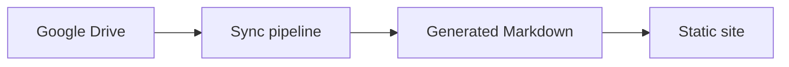

<!-- AUTO-GENERATED BY CTCDOCS SYNC. DO NOT EDIT. -->

A mermaid fence has to be claimed before the code-frame renderer sees it,
or the diagram publishes as a listing of its own source.

The diagram above is the whole publication path, which is also the order
the pipeline writes its output in.
