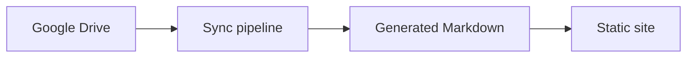

<!-- AUTO-GENERATED BY CTCDOCS SYNC. DO NOT EDIT. -->

A mermaid fence has to be claimed before the code-frame renderer sees it,
or the diagram publishes as a listing of its own source.

```mermaid
flowchart LR
  Drive[Google Drive] --> Sync[Sync pipeline]
  Sync --> Markdown[Generated Markdown]
  Markdown --> Site[Static site]
```

The diagram above is the whole publication path, which is also the order
the pipeline writes its output in.

## Reading the diagram

Each arrow is one step the pipeline takes on every run.

#### Arrows

An arrow points from what a step reads to what it writes.

## Reading the diagram

The same steps run for a single document and for the whole corpus.
